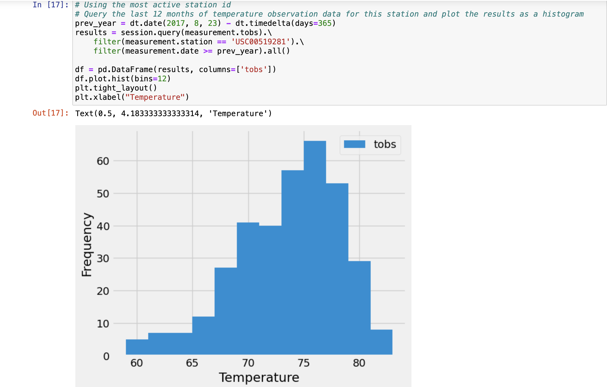
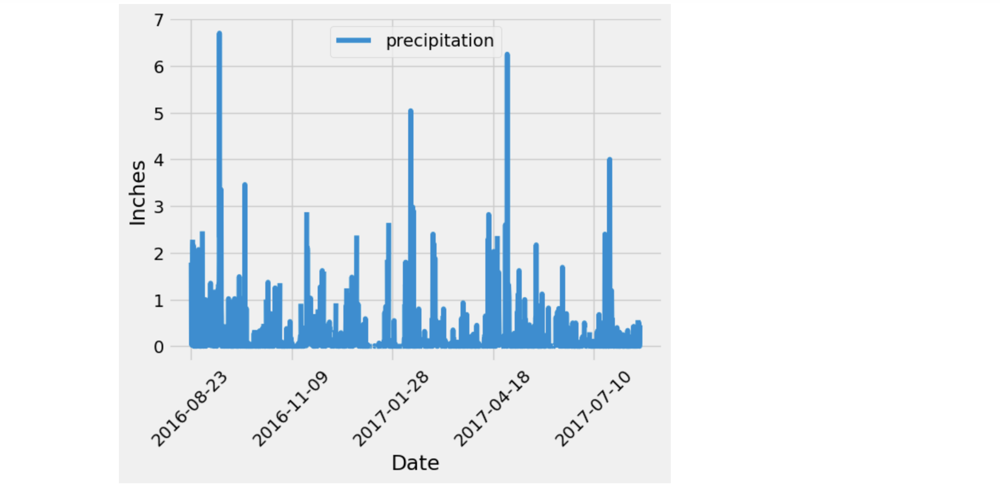
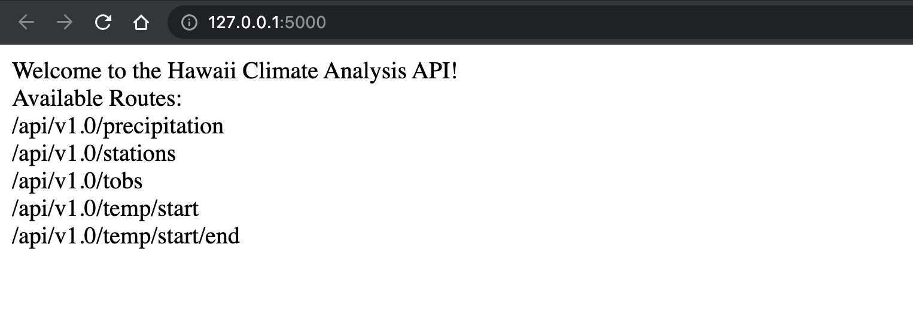
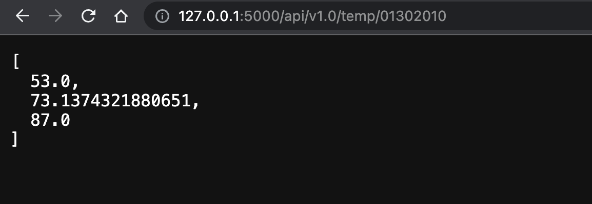
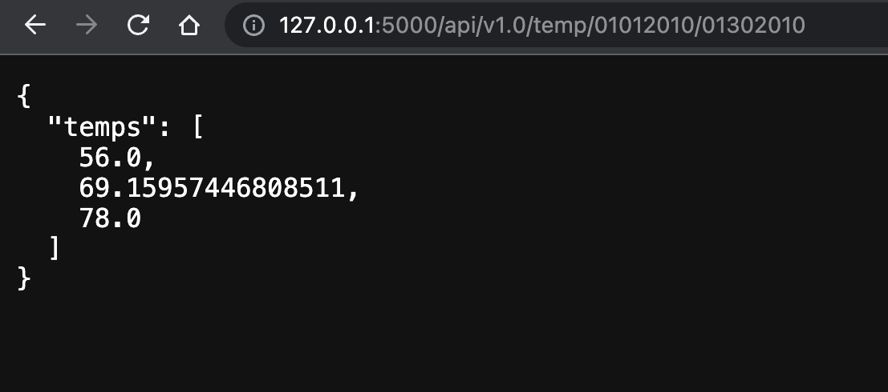
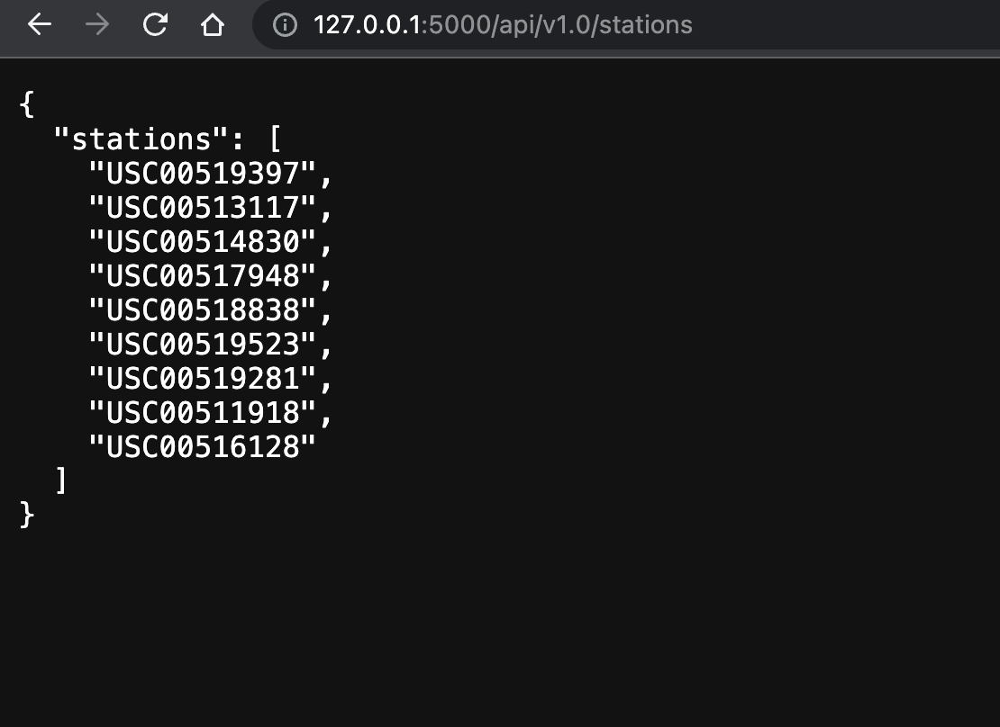

# SQL Alchemy Challenge
Fantastic! You've chosen to indulge in an extended holiday getaway to Honolulu, Hawaii. To streamline your trip planning, you've opted to conduct a comprehensive climate analysis for the region. The subsequent sections delineate the steps necessary to accomplish this task.

### Part 1: Analyze and Explore the Climate Data

In this segment, you will employ Python and SQLAlchemy to conduct a fundamental climate analysis and explore the climate database. Your toolkit will include SQLAlchemy ORM queries, Pandas, and Matplotlib. To complete this task, follow the steps outlined below:

Please note that the provided files (climate_starter.ipynb and hawaii.sqlite) are at your disposal for executing the climate analysis and data exploration.

1. Utilize the SQLAlchemy create_engine() function to establish a connection to your SQLite database.
2. Implement the SQLAlchemy automap_base() function to reflect your tables into classes. Subsequently, save references to the classes named station and measurement.
3. Establish a link between Python and the database by creating a SQLAlchemy session.
4. Conduct a precipitation analysis, followed by a station analysis, by executing the steps outlined in the subsequent two subsections.

#### Precipitation Analysis
1. Find the most recent date in the dataset.

2. Using that date, get the previous 12 months of precipitation data by querying the previous 12 months of data.
3. Select only the "date" and "prcp" values.

4. Load the query results into a Pandas DataFrame. Explicitly set the column names.

5. Sort the DataFrame values by "date".

6. Plot the results by using the DataFrame plot method
7. Use Pandas to print the summary statistics for the precipitation data.

#### Station Analysis
1. Design a query to calculate the total number of stations in the dataset.

2. Design a query to find the most-active stations (that is, the stations that have the most rows). To do so, complete the following steps:

    * List the stations and observation counts in descending order.
    * Answer the following question: which station id has the greatest number of observations?
3. Design a query that calculates the lowest, highest, and average temperatures that filters on the most-active station id found in the previous query.
4. Design a query to get the previous 12 months of temperature observation (TOBS) data. To do so, complete the following steps:

    * Filter by the station that has the greatest number of observations.

    * Query the previous 12 months of TOBS data for that station.

    * Plot the results as a histogram with bins=12
5. Close your session.

### Part 2: Develop Your Climate App

Now that you've concluded your initial analysis, proceed to design a Flask API based on the queries you've just formulated. Utilize Flask to create the following routes:

1. /

    *   Navigate to the homepage.

    * List all available routes.

2. /api/v1.0/precipitation

    * Transform the query results from your precipitation analysis (i.e., retrieve only the last 12 months of data) into a dictionary using the date as the key and prcp as the value.

    * Return the JSON representation of your dictionary.

3. /api/v1.0/stations

    * Return a JSON list of stations from the dataset.

4. /api/v1.0/tobs

    * Query the dates and temperature observations of the most active station for the previous year of data.

    * Return a JSON list of temperature observations for the previous year.

5. /api/v1.0/<start> and /api/v1.0/<start>/<end>

    * Return a JSON list of the minimum temperature, average temperature, and maximum temperature for a specified start or start-end range.

    * For a specified start, calculate TMIN, TAVG, and TMAX for all dates greater than or equal to the start date.

    * For a specified start date and end date, calculate TMIN, TAVG, and TMAX for the dates from the start date to the end date, inclusive.

## How to Install and Run the script

To run this script:
1. Copy the git link in your local git repository
2. Ensure *SurfsUP*, *Resources* directories and *climate_starter.ipynb* and *app.py* files are present
3. Ensure the respective csv datasets are present in the *Resources* folder
4. Run the script using **Jupyter Notebook** from *SurfsUp* directory and view results
5. Be sure to run the entire script using *Restart & Run All option* from *Kernel* in *Jupyter Notebook* to get error free results
6. Or, you could alternatively run each block of code individually starting from the very top 
7. Once the jupyter notebook is run successfully and the respective charts are generated. Run the *app.py* file from VScode using an integrated terminal to recieve the localhost address where flask would host the webpage with respective flask routes
8. You could test out the different flask routes by adding it to the initial url (or localhost:5000) and verify the results.

---
## Credits

To write this script, I used the starter code provided and discussed the route calculations and charts with my TAs and tutor.   

They helped me write a small portion of the logic to calculate some routes and helped me understand how flask works to bridge the gap between front end and backend.   

---

